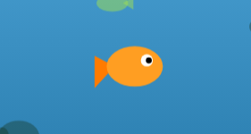
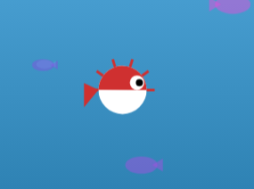
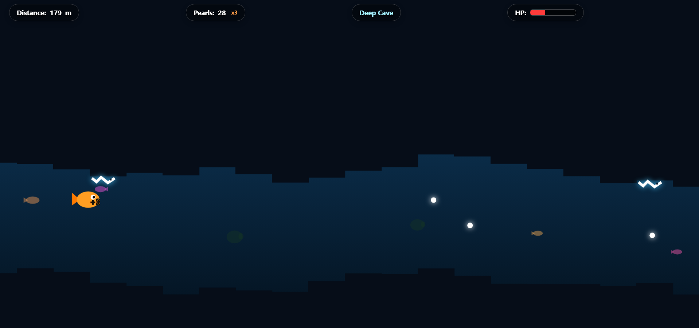

# DeepCaves

In game you are a tiny fish and you have to  survive in these underwater cave tunnels for as long as you can. 

inspired by hollow knight ,
i am fish, working on a bigger open world exploration version of this, in which you can explorle world with proper puzzles and story mode for each fish.
coming soon
stay tuned :D  

play here : https://sooraj4.itch.io/deepcaves

## controls

- move : wasd / arrow keys
- dash : shift or space (orange only)
- shrink : ctrl or x (puff only)

## Characters

Orange :faster and has a dash, press shift or space.good for going fast through gaps in timing, in future when preadtor fish chase  you .

Puff  : slower, no dash but hold ctrl or x. Good for going through small gaps.

## Powerups

shield (blue orb) - takes one hit for you. you can see the aura around the fish when its active

 

magnet (purple orb) - sucks nearby pearls toward you for 10 seconds, really good for combos

## Scoring

collect white pearls, pick them up fast enough and you get a combo multiplier up to x5. wait too long or take damage and it resets

## Stages/Biomes

Open Sea 

Cave : Caves appear and beware of jelly fish. 

Deep Cave:Darker caves , eels on the walls shooting bolts

## Tech

Just HTML, CSS and JS. Canvas API for all the drawing.

Made with love .Probably not perfect but I'm pretty happy with how it turned out.

love to know what you thought of my game :D
